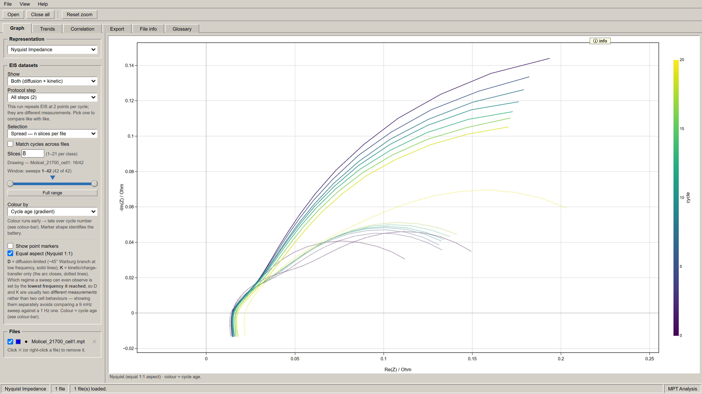

# Battery Data Visualizer

A single-file, browser-based viewer for **BioLogic EC-Lab `.mpt` files**. Drop in one or more
raw exports and get interactive impedance plots, cycling trends, correlation maps, and a
cleaned Excel export — no install, no server, no data leaving your machine.

Built for the **Rolston Lab (ASU)**.



<sub>Nyquist view of one cell over 20 cycles — solid lines are the diffusion-limited (Warburg) branch, dotted lines the kinetic arc, coloured early → late by cycle number.</sub>

---

## Quick start

1. Download `Rolston_BatteryViewer_V1.1.html` (green **Code → Download ZIP**, or clone the repo).
2. Double-click it. It opens in your default browser.
3. Click **Open** — or drag `.mpt` files straight onto the page.

That's it. There is nothing to install and no build step.

> **You do need an internet connection.** The plotting (Plotly) and Excel-export (SheetJS)
> libraries load from a CDN at page load. Offline, the page opens but charts won't render.

### Which file do I use?

| File | Use it? |
|---|---|
| `Rolston_BatteryViewer_V1.1.html` | ✅ **Yes** — current version |
| `Rolston_BatteryViewer_V1.html` | Kept for reference / reproducing older figures |

---

## What it does

Load any number of `.mpt` files at once. Each is parsed in the browser, and every tab works
across the whole loaded set.

### 📈 Graph
Interactive Plotly charts with zoom, pan, hover readouts, and **Reset zoom**:

- **Nyquist**, **Bode**, and **Black** impedance plots (EIS)
- **3D discharge curve**
- **Within-cycle profiles** — plotted against time in cycle or capacity
- **Custom** — pick your own X and Y from any parsed column

Control what you're looking at with:

- **Row filter** — all rows, EIS only (`freq/Hz > 0`), or non-EIS (DC cycling) rows
- **Cycle selection** — full range, every *N*th sweep, an evenly spread set of slices, or a
  hand-typed list of cycle numbers
- **Colour by** — cycle age (gradient), sweep, protocol step (`Ns`), or source file
- **Layout** — one battery, stacked panels (one per file), or all overlaid on shared axes

### 📊 Trends
Per-cycle behaviour across the run — line vs. cycle number, or box plots showing the spread
*within* each cycle. Useful for capacity fade, coulombic efficiency, and resistance growth.

### 🔗 Correlation
Pearson correlation matrix rendered as a heatmap, so you can see which measured columns move
together. Filterable to EIS rows, non-EIS rows, or both.

### 💾 Export
Writes the parsed, filtered data to `.xlsx` — column selection included, so you can hand a
tidy sheet to Excel, Python, or MATLAB instead of re-parsing raw `.mpt` headers.

### ℹ️ File info & 📖 Glossary
File info surfaces the EC-Lab header metadata. The glossary explains what each column
actually means — including the part that trips people up:

> Rows are logged **on events, not on a fixed clock**. A new row is written whenever a set
> time passes, *or* voltage / current / charge moves by a set amount. Stable plateaus produce
> few rows; fast changes produce many. Every row carries a **cycle number** (one charge + one
> discharge = one cycle) and an **`Ns`** protocol-step index. EIS rows have `freq/Hz > 0`;
> DC cycling rows have `freq/Hz = 0`, so most impedance columns read `0` on cycling rows.

---

## Your data stays local

The viewer contains **no network calls of any kind**. Files are read with the browser's
`FileReader` API and parsed in memory — nothing is uploaded, logged, or transmitted. The only
outbound requests the page makes are for the two CDN libraries above.

---

## Input format

- **Accepts:** `.mpt`, `.txt` (BioLogic EC-Lab text exports)
- **Multiple files at a time:** yes — that's what the comparison layouts are for
- The EC-Lab header block (`Nb header lines : …`) is parsed automatically; you don't need to
  strip it first

---

## Version history

**V1.1** — adds multi-battery comparison (stacked panels and overlay layouts), colour-by-cycle-age
gradients, colour-by-protocol-step, typed cycle lists, and a choice of X-axis for within-cycle
profiles.

**V1** — original release shared to Discord. Single-battery focus.

---

## Repository

```
Rolston_BatteryViewer_V1.html      # original release
Rolston_BatteryViewer_V1.1.html    # current version
```

Each file is fully self-contained — all HTML, CSS, and JavaScript in one document. To modify
it, open it in any text editor; there is no toolchain to set up.

---

## Credits

Written by **[Isaiah Milkey](https://github.com/Isaiah-Milkey)**. Originally developed at
[Isaiah-Milkey/MPT_FileViewer](https://github.com/Isaiah-Milkey/MPT_FileViewer), which remains
the upstream repository — full commit history and authorship are preserved here.

Built on [Plotly.js](https://plotly.com/javascript/) and [SheetJS](https://sheetjs.com/).

---

## License

Released under the [MIT License](LICENSE) — free to use, modify, and redistribute, with
attribution and without warranty.

Copyright © 2026 Rolston Lab, Arizona State University. The original code was authored by
Isaiah Milkey; please keep that attribution intact in any derivative work.
